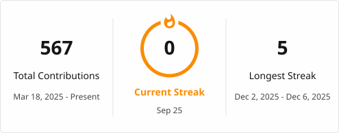

  <!-- Dynamic Header Badge -->
  

  

    <strong>Specialized in building accessible, high-performance web applications with clean code architectures.</strong>
  

  <!-- Quick Links / Badges -->
  

    
    
  

---

### Core Tech Stack

  

---

### Highlights & Current Focus

- **Portfolio:** Built with [Astro v7](https://astro.build), [Tailwind CSS v4](https://tailwindcss.com), and i18n at [aitorias.is-a.dev](https://aitorias.is-a.dev)
- **Current Focus:** Type-safe web architectures, modern i18n workflows, performance optimization, and custom GA4 web worker tracking via Partytown
- **Tooling:** Automated CI/CD pipelines, high-performance linting & formatting with [Oxc](https://oxc.rs)

---

### GitHub Analytics

  
  

 

  <!-- Streak Stats Card -->
  

---

## Version History

| Readme Version | Description | Author | Date |
| :--- | :--- | :--- | :--- |
| `v1.0.0` | Initial profile release with Japanese Pastel theme design. | Aitor de Diego | 2026-08-10 |
| `v1.1.0` | Updated domain links to `aitorias.is-a.dev`, stack updates (Astro v7, i18n, Partytown), and LinkedIn link. | Aitor de Diego | 2026-08-14 |

---

  Designed to match the <strong>aitorias.is-a.dev</strong> Japanese Pastel Theme.

